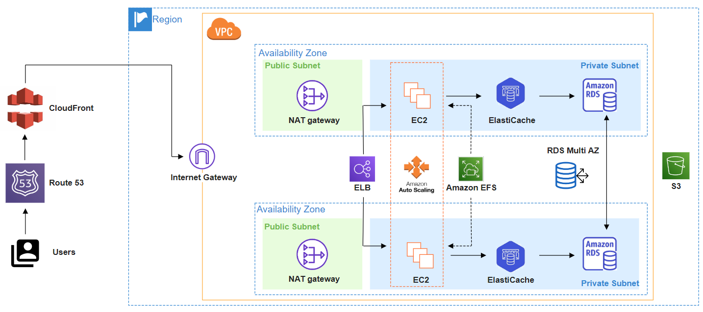

# Create a Web Host based on WordPress FE

Partendo da una *Route 53* per la gestione del DNS che collegato ad un *CloudFront* per la gestione e l'instradamento più efficiente da parte di clienti sparsi per il globo, a tal fine questa scelta migliora la latenza e le prestazioni del servizio offerto, in questo caso è un sito web che potrebbe offrire servizi in real time come uno store Apple che nel drop di un item di ultima generazione fa incetta di click, ecco questa soluzione diminuirebbe il vantaggio dei clienti americani nel portarsi a casa i prodotti nel carrello nel day one. Se invece stessimo parlando di un servizio di streaming come Netflix oppure in generale una compagnia che mette a disposizione media la latenza non cambierebbe molto la fruizione del servizio quindi potremmo fare a meno di CloudFront e del suo servzio di *Content Delivery Network* (CDN).

In entrambi i casi andremo a puntare il servizio ad un *Elastic Load Balancer* che gestisce il traffico in ingresso andando ad aumentare e diminuire le istanze *EC2* configurate all'interno di un *autoscaling group*, questo permette di abbattere i costi utilizzando senza sprechi le istanze quando la domanda cresce. Di fatto questo può essere configurato attraverso delle scaling policy, in base al servizio offerto per esempio un sito di scommesse come SISAL che ha un aumento delle richieste durante il fine settimana per le partite di calcio, esso può andare ad aumentare le istanze disponibili dal Venerdì e diminuirle il Martedì. Oppure si possono usare politiche che attraverso AI prevedono i picchi di domanda e accomodano i clienti di conseguenze, queste magari possono essere più utili per siti web dove non è così facile prevedere l'aumento del traffico.

L'autoscaling group puntato dall'elastic load balancer quindi sarà creato all'interno di una rete privata di AWS, chiamata *Virtual Private Cloud* (VPC), dove le istanze generate dall'autoscaling group verranno sistemate all'interno di una subnet privata che comunica all'esterno attraverso l'elastic load balancer e tutti quegli indirizzi IP che riteniamo necessari per la sua manutenzione, se dovesse essercene bisogno. Questa VPC quindi andrà a ricoprire diverse *Availability Zone*, in modo tale da poter creare un infrastruttura resiliente a danni ambientali di media-larga entità. 

Le istanze EC2, quindi all'interno della subnet privata, andranno a puntare ad *Amazon Realational Database Service* (RDS) che mette a disposizione in automatico un servizio altamente disponibile ed efficiente che si paga solo per l'effettivo uso del database. Inoltre essendo altamente disponibile, esso crea in automatico delle copie di backup, che nel caso di punto di fallimento vengono promosse a DB principale dal quale dopo verranno create altre repliche. Si possono andare anche a salvare degli scatti del DB all'interno di *bucket S3* che noi sappiamo essere molto affidabili e durevoli, se riteniamo i dati altamente importanti.   

Per quanto riguarda il software di web hosting vero e proprio sul quale le istanze EC2 andranno a caricare il WordPress io ritengo che bisogni utilizzare NGINX per la sua alta efficienza nel gestire diverse connessioni sincrone sulla macchina, optando che il cliente che sta aprendo il sito webin crescita.
NGINX nasce proprio dalle incapacità di Apache nel gestire il problema dei C10k che nel '99 affligeva i server. Oggi giorno se vi sono ancora numeri da parte di Apache, è dovuto anche dal fatto che esso è presente di default nella maggior parte dei sistemi operativi, una sorta di Internet Explorer dei web server, come sappiamo invecchiano male queste tipologie di soluzioni.

Per automatizzare la distribuzione e la gestione dei servizi AWS anche in caso di soluzioni ibride andrei ad utilizzare il servizio di *CloudFormation*, quest'ultimo può essere configurato attraverso una serie di comandi che possono essere descritti anche all'interno di un file formattato in JSON, in questo modo l'infrastruttura può essere automatizzata vedendola come codice dal quale poi gestire tutti i servizi in essere.

